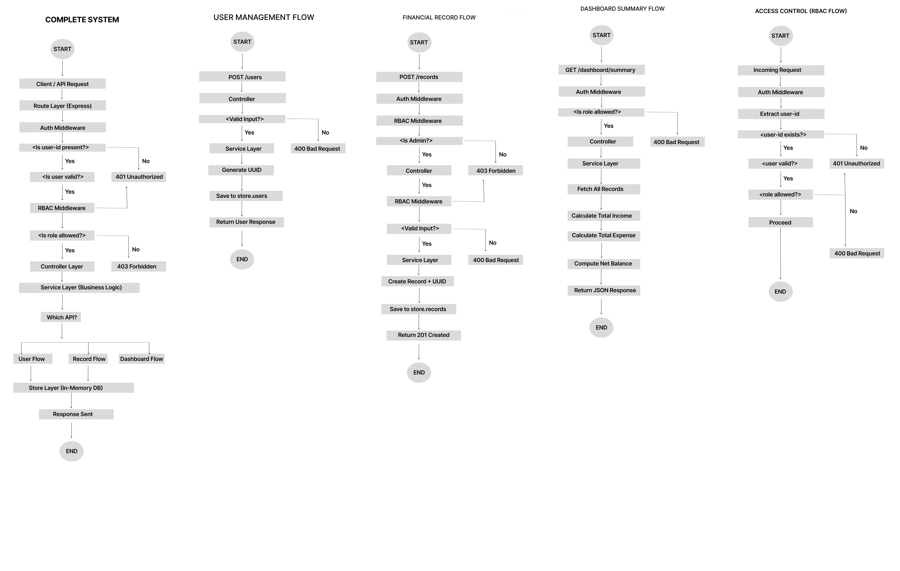

📌 Overview

This project is a backend system for a finance dashboard that manages users, financial records, and provides summary analytics with Role-Based Access Control (RBAC).

The system is designed using clean architecture principles with proper separation of concerns.

🚀 Features
	•	User Management with roles (Viewer, Analyst, Admin)
	•	Financial Records CRUD (Create, Read, Delete)
	•	Dashboard Summary (Income, Expense, Balance)
	•	Role-Based Access Control (RBAC)
	•	Clean layered architecture

🧠 Architecture Flow
Client → Routes → Auth Middleware → RBAC → Controller → Service → Store → Response

🛠️ Tech Stack
	•	Node.js
	•	Express.js
	•	UUID
	•	In-memory storage

📁 Project Structure
finance-dashboard-backend/
│
├── src/
│   ├── routes/
│   │   ├── userRoutes.js
│   │   ├── recordRoutes.js
│   │   └── dashboardRoutes.js
│   │
│   ├── controllers/
│   │   ├── userController.js
│   │   ├── recordController.js
│   │   └── dashboardController.js
│   │
│   ├── services/
│   │   ├── userService.js
│   │   ├── recordService.js
│   │   └── dashboardService.js
│   │
│   ├── middleware/
│   │   ├── authMiddleware.js
│   │   ├── rbacMiddleware.js
│   │   └── errorMiddleware.js
│   │
│   ├── store/
│   │   └── store.js
│   │
│   ├── utils/
│   │   └── validator.js
│   │
│   └── app.js
│
├── package.json
└── README.md

⚙️ Setup Instructions

1. Clone the repository
git clone https://github.com/Rahul9672/finance-dashboard-backend.git
cd finance-dashboard-backend

2. Install dependencies
npm install

3. Run the server
npm run dev

Server runs at:
http://localhost:3000

🧪 API Testing (Postman)

⸻

👤 1. Create User

OST /users

Request:
{
  "name": "Rahul",
  "role": "admin"
}

Response:
{
  "id": "f0eab447-xxxx",
  "name": "Rahul",
  "role": "admin",
  "active": true
}

🔐 Header (IMPORTANT)
Use this in all protected routes:
user-id: <copied-user-id>

💰 2. Create Record

POST /records

Headers:
user-id: <user_id>

Request:
{
  "amount": 5000,
  "type": "income",
  "category": "salary"
}

Response:
{
  "id": "uuid",
  "userId": "user_id",
  "amount": 5000,
  "type": "income",
  "category": "salary"
}

🔐 Role-Based Access Control
Role             Access
Viewer           Read only
Analyst          Read + Dashboard
Admin            Full access

⚠️ Error Handling
Code            Meaning
400             Bad Request
401             Unauthorized
403             Forbidden
500             Server 

💾 Data Storage
	•	Uses in-memory store
	•	Data resets on server restart

⚖️ Tradeoffs
	•	Simple but not persistent
	•	Mock authentication

⸻

🚀 Future Improvements
	•	JWT Authentication
	•	MongoDB Integration
	•	Pagination & Filters
	•	Swagger Documentation

⸻

✅ Conclusion

This project demonstrates backend architecture, API design, RBAC implementation, and financial data processing in a clean and scalable manner.
:::

## 🎨 System Flowchart (Figma)

To better understand the backend architecture and data flow, a detailed system flowchart has been designed in Figma.

🔗 Figma Design Link:
https://www.figma.com/design/qdEUmCdzxxueSno1fPLTdt/Finance-Data-Processing---Access-Control-Backend-Flowchart

---

## 🔄 System Working (Flow Explanation)

The backend system follows a structured flow to ensure secure and efficient data processing:

### 1. Request Handling
- Client sends API request
- Request is routed through Express routes

### 2. Authentication
- Auth middleware checks for `user-id` in headers
- Validates if the user exists in the system

### 3. Authorization (RBAC)
- Role-Based Access Control middleware verifies permissions
- Ensures only authorized roles can access specific endpoints

### 4. Business Logic Execution
- Controller receives the request
- Service layer processes business logic
- Data is validated and processed accordingly

### 5. Data Storage
- Processed data is stored in the in-memory store
- Acts as a temporary database

### 6. Response Generation
- Final response is sent back to the client
- Includes success or error status

---

## 🧩 Flow Modules Covered

The flowchart includes the following system modules:

- Master System Flow (Request → Response lifecycle)
- User Management Flow
- Financial Record Flow
- Dashboard Summary Flow
- Access Control (RBAC Flow)

This provides a complete visualization of how the system operates internally.

## 🎨 System Architecture Flowchart

🔗 Figma Design:
https://www.figma.com/design/qdEUmCdzxxueSno1fPLTdt/Finance-Data-Processing---Access-Control-Backend-Flowchart

---

## 🔄 System Flow Explanation

The backend system follows a structured layered architecture:

### 🧩 Master Flow
Client → Route → Auth → RBAC → Controller → Service → Store → Response

### 👤 User Management Flow
Handles user creation, validation, and storage using UUID-based identification.

### 💰 Financial Record Flow
Ensures only authorized users (Admin) can create financial records with proper validation.

### 📊 Dashboard Flow
Aggregates financial data to calculate total income, expenses, and net balance.

### 🔐 RBAC Flow
Validates user identity and role permissions before allowing access to protected APIs.